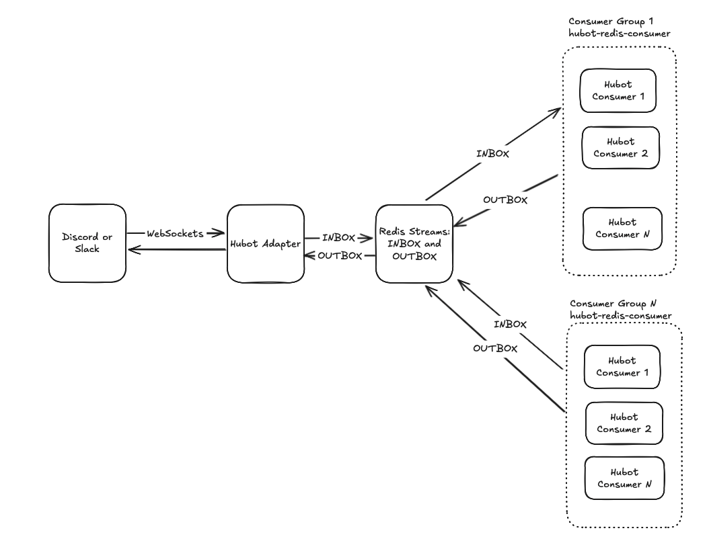

# hubot-redis-consumer

A Redis consumer adapter for Hubot, designed for scalable, distributed chat automation using Redis streams and consumer groups.



## Features

- Connects Hubot to Redis streams for inbox/outbox message processing
- Supports Redis consumer groups for horizontal scaling
- Handles multiple chat providers (e.g., Slack, Discord) via Hubot Chat Adapters
- Graceful shutdown and error handling

## Installation

```sh
npm install
```
## Usage

Start the consumer with environment variables to configure Redis and stream names:

```sh
HUBOT_REDIS_URL=redis://localhost:6378 HUBOT_CONSUMER_GROUP_NAME=hubot-group HUBOT_INBOX_STREAM_NAME=hubot-inbox HUBOT_OUTBOX_STREAM_NAME=hubot-outbox HUBOT_CONSUMER_NAME=hubot-consumer-1 npm start
```

### Environment Variables

- `HUBOT_REDIS_URL` (default: `redis://localhost:6378`) - URL of the Redis instance to use.
- `HUBOT_CONSUMER_GROUP_NAME` (default: `hubot-group`) - Name of the Redis Consumer Group.
- `HUBOT_CONSUMER_NAME` (default: `hubot-consumer-1`) - Name (identifier) of this instance. This is where you spin up multiple instances with different names to horizontally scale Hubot's functionality.
- `HUBOT_INBOX_STREAM_NAME` (default: `hubot-inbox`) - Name of the Redis Stream to use as the incoming stream of messages that the consumers will read from.
- `HUBOT_OUTBOX_STREAM_NAME` (default: `hubot-outbox`) - Name of the Redis Stream to use as the outgoing stream of messages that the Hubot Chat Adapters will read off from and send them to the Chat system in response to Hubot commands.

## How It Works

- Listens to a Redis stream for incoming messages (`INBOX`)
- Processes messages using Hubot scripts
- Replies and sends messages to an outbox Redis stream (`OUTBOX`)
- Uses consumer groups for distributed processing. Redis load balances the commands across the instances of Hubot (consumers).

## Example

See `RedisConsumer_Test.mjs` for a test that demonstrates replying to an inbox message and writing to the outbox stream.

## Scripts

- `npm start` — Start Hubot with the Redis consumer adapter
- `npm test` — Run tests

## Run Redis

```sh
docker run --rm -p 6378:6379 -d --name hubot-redis -v $(pwd)/redis-data:/data redis redis-server --appendonly yes
```